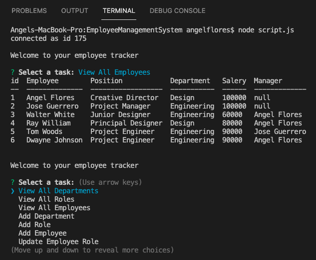

# Employee Management System

## Description
    This command line application helps the human resources department keep track of employee roles, 
    departments and managers. This allows companies to save time by just answering a few questions about 
    their current or new employees that are joining a new team, getting a department change or getting a 
    new manager. This application deploys with NodeJS and was created using JavaScript, Inquirer package 
    and MySQL. 

## Installation
    npm install

## Deployment
    node script.js    

## Scenario
    - Run node script.js on the command line.
    - The user employer responds to the generated questions.
    - After the last question is answered, the updates get added to the database.
    - The employer saves time and can keep track of new employees and teams. 

## Video Demo

[Demo]()
Click "Demo" for video demo. 

## License

## Screenshots of README Generator Functionality

